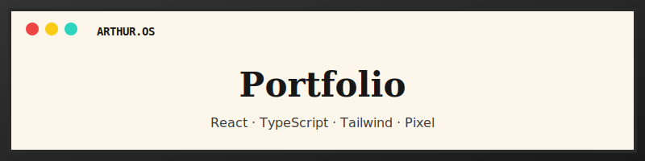
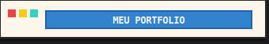

<div align="center">



# Portfolio — Arthur Viana

**Site pessoal** com visual **pixel art + janelas estilo macOS**, tema creme e integração com a **API pública do GitHub** para listar repositórios.

[](https://arthur-dv.github.io/Portfolio/)

[](https://react.dev/)
[](https://www.typescriptlang.org/)
[](https://vitejs.dev/)
[](https://tailwindcss.com/)

[](./package.json)
[](https://github.com/Arthur-dv/Portfolio/issues)

[Ver no GitHub](https://github.com/Arthur-dv/Portfolio) · [Reportar problema](https://github.com/Arthur-dv/Portfolio/issues)

</div>

---

## Pré-visualização

| Intro “PRESS START” | Projetos com filtros |
| :---: | :---: |
| Tela inicial com animação e botão para entrar | Cards com busca, **Todos / Destaques / Recentes** e dados da API |

> Dica: depois do primeiro deploy, podes substituir esta secção por capturas reais: guarda imagens em `docs/` (por exemplo `docs/preview-home.png`) e usa ``.

---

## Funcionalidades

- **Intro fullscreen** com animação e transição para o conteúdo principal
- **Navegação por secções** (Sobre, Projetos, Experiência, Contacto) com estado ativo
- **Repositórios GitHub** do utilizador `Arthur-dv`, com pesquisa e filtros
- **Experiência profissional** e **contacto** com detalhes em painéis estilo “janela”
- **Tipografia pixel** (Press Start 2P) + **Inter** para texto corrido
- **Layout responsivo** e scroll reveal nas secções

---

## Stack

| Tecnologia | Uso |
|------------|-----|
| **React 19** | UI e estado |
| **TypeScript** | Tipagem |
| **Vite 8** | Build e dev server |
| **Tailwind CSS 4** | Estilos e tema (`@theme`) |
| **GitHub REST API** | Lista de repositórios públicos |

---

## Como executar localmente

Requisitos: **Node.js** 20+ (recomendado) e **npm**.

```bash
git clone https://github.com/Arthur-dv/Portfolio.git
cd Portfolio
npm install
npm run dev
```

Abre o endereço que o Vite indicar (normalmente `http://localhost:5173`).

### Scripts

| Comando | Descrição |
|---------|-----------|
| `npm run dev` | Servidor de desenvolvimento com hot reload |
| `npm run build` | Compilação TypeScript + bundle de produção em `dist/` |
| `npm run preview` | Servir o build localmente para testar antes do deploy |

---

## Deploy

O output de `npm run build` fica em **`dist/`** (HTML, JS e CSS já empacotados — **não** o `main.tsx` da pasta `src/`).

### GitHub Pages (neste repo)

O **404 em `main.tsx`** aparece quando o GitHub Pages serve a **branch `main`** (o `index.html` da raiz com `/src/main.tsx`). O build correto está em **`dist/`** após `npm run build`.

Este projeto usa um workflow que faz o build e envia o conteúdo de **`dist/`** para a branch **`gh-pages`**. O site deve usar **essa** branch, não a `main`.

1. Faz **push** (o workflow [`.github/workflows/deploy-pages.yml`](.github/workflows/deploy-pages.yml) corre sozinho).
2. **Settings → Pages → Build and deployment**:
   - **Source:** **Deploy from a branch** (não uses “só” GitHub Actions com artefacto se o site ainda mostrar `main.tsx`).
   - **Branch:** **`gh-pages`** → pasta **`/ (root)`** → **Save**.
3. Espera 1–2 minutos e abre o URL que aparece em Pages (ex.: **`https://arthur-dv.github.io/Portfolio/`**).

O [`vite.config.ts`](vite.config.ts) usa `base: '/Portfolio/'` em produção. Se o nome do repositório no GitHub for outro, altera para `'/nome-exato-do-repo/'`.

### Outras hospedagens (Vercel, Netlify, etc.)

Define o diretório de publicação como **`dist`**, o comando de build como **`npm run build`**, e em **Vercel/Netlify** costuma usar-se `base: '/'` — nesse caso remove ou ajusta o `base` em `vite.config.ts` para coincidir com o URL do site.

---

## Estrutura do repositório (resumo)

```
Portfolio/
├── public/          # Ficheiros estáticos (ex.: imagem de perfil)
├── src/
│   ├── App.tsx      # Página principal e lógica
│   ├── index.css    # Tema Tailwind + estilos pixel
│   └── main.tsx     # Entrada React
├── docs/            # Recursos do README (banner, futuras screenshots)
├── index.html
└── vite.config.ts
```

---

## Licença

Licença **ISC** (campo `license` em `package.json`).

---

<div align="center">

Feito com dedicação · Belo Horizonte, Brasil

</div>
